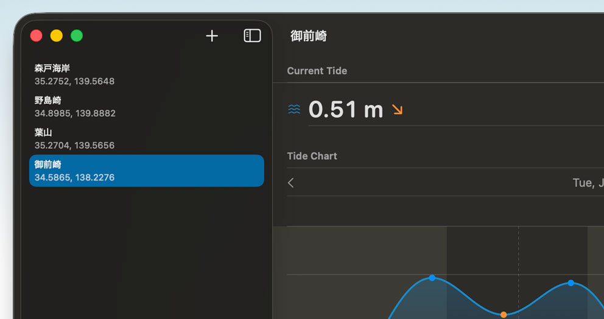
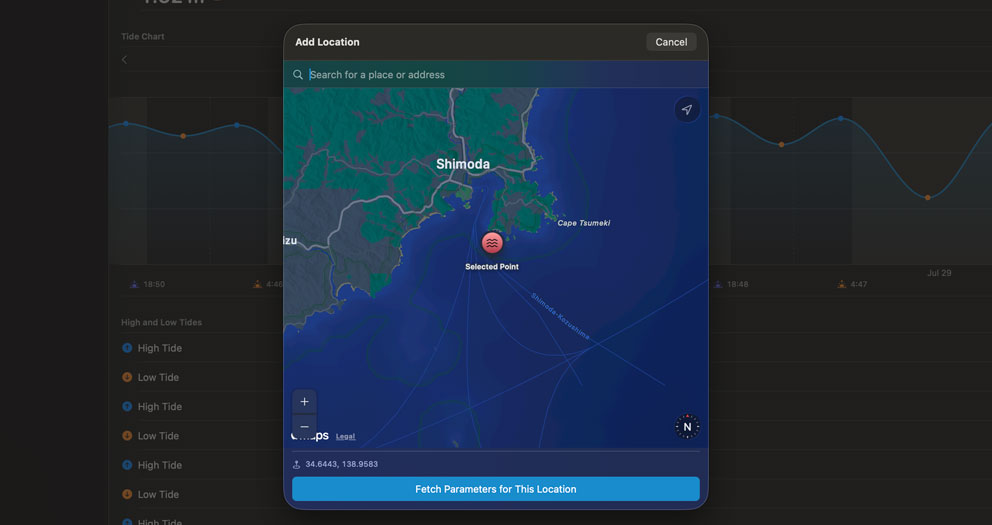

I've released **Shiomi**, a tide chart app that runs on iPhone / iPad / Mac / Apple Vision Pro / Apple Watch. "Shiomi" (潮見) is Japanese for "tide watching".

It's free, with no ads and no in-app purchases.

[App Store](https://apps.apple.com/app/shiomi-simple-tide-chart/id6754582175) / [Website](https://shiomi-app.ngs.io/)

## What makes it different

Unlike most existing tide apps, Shiomi downloads the harmonic constants for a location — the parameters of the tidal constituents at that latitude and longitude — and stores them in the app. Tide predictions are then computed entirely on device, with no network requests, so it stays fast and responsive offline or out in the field with poor reception.

<!--more-->

## Why I built it

I spend my days thinking about fishing, so I check weather apps and tide charts constantly.

For weather I'm happy with the paid tier of [Windy], but for tides I couldn't find an app that didn't get in my way:

- Requires a subscription, or shows ads
- Bundles features I don't need, like bite-time predictions
- Custom UI that doesn't feel at home on the OS
- Runs only on Apple Watch, with no iPhone or Mac app

To fix all of that, I built my own API that serves the harmonic parameters, and wrote the client in SwiftUI — a lightweight, simple piece of software that stays out of your way.

## How it works

The UI is as simple as it gets: register the locations you want tide charts for, then pick one.

Tap the add (+) button to open the map, fetch the parameters, and the location is ready.

## Open source

Everything is on GitHub:

- The app: [ngs/tides-swift](https://github.com/ngs/tides-swift)
- The tide computation API: [ngs/tides-api](https://github.com/ngs/tides-api)

If you find a bug and figure out a fix, pull requests are very welcome.

## Feedback

If you notice anything — a feature you'd like, a location that renders wrong — let me know via [GitHub Issues](https://github.com/ngs/tides-swift/issues).

I'd especially love to hear "here's what's missing" from people who use tide charts for fishing or surfing.

[Windy]: https://www.windy.com/
